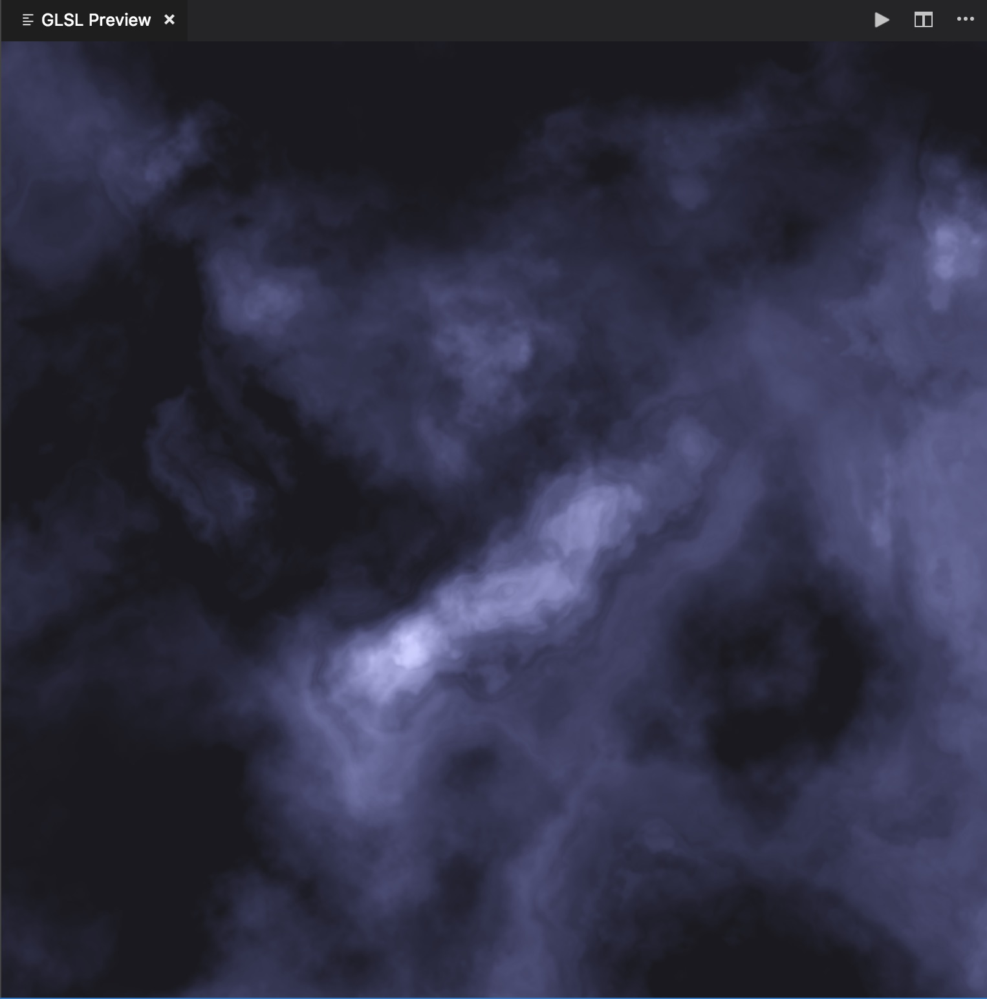

# glsl_warping_clouds
Some glsl experiments to form clouds.

### References
- https://thebookofshaders.com/13/
- https://www.shadertoy.com/view/4tdSWr

### Enviroment 
- [Visual Studio Code](https://code.visualstudio.com/)
- [Shader Toy for Visual Studio Code](https://marketplace.visualstudio.com/items?itemName=stevensona.shader-toy)

